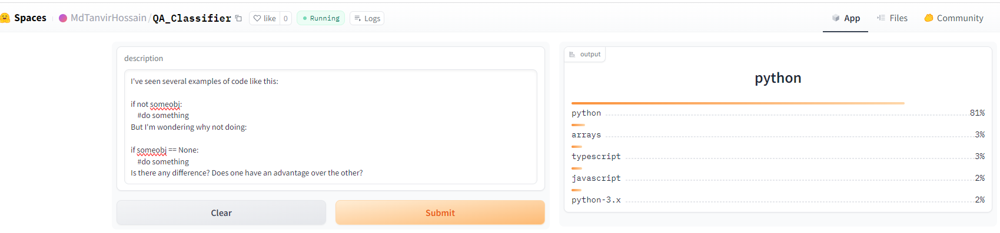
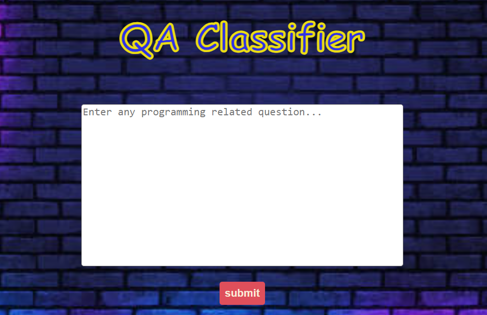
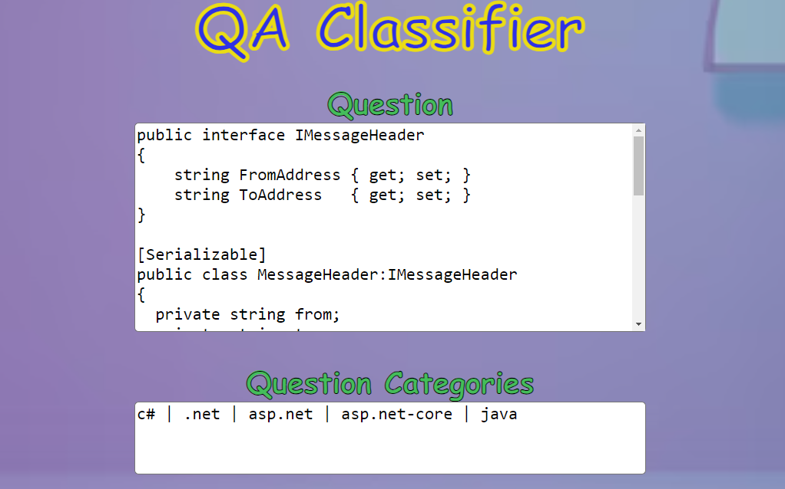

# MultiLabel-Book-Genre-Classifier(QA_Classifier)

A text classification model from data collection, model training, and deployment.
The model can classify 69 different types of questions categories.
The keys of `deployment\category_types_encoded.json` contains the questions categories.

# Data Collection

Data was collected from a Stackoverflow Website's questions segment: https://stackoverflow.com/questions
The data collection process is divided into two steps:

1. **Question URL Scraping:** The question urls were scraped with `scraper\questions_url_scraper.py` and the urls are stored along with question title in `data\questions_urls.csv`

2. **Question Details Scraping:** Using the urls, full question and categories/tags were scraped with `scraper\questions_details_scraper.py` and stored in `data\questions_details.csv`. 

In total, I scraped 22124 book details and 22257 question urls. Some urls didn't contain any valid page. Those details were ignored. 

# Data Preprocessing

Initially there were 10634 different categories in the dataset. After some analysis, I found out 10565 of them are rare (contains less amout of related questions). So, I removed those categories and then I have 69 categories only. After removing the data with rare categories there were 17011 samples left in total. Fortunately, dataset didn't have any null values.

# Model Training
Finetuned a distilrobera-base and distilbert-base-uncased model from HuggingFace Transformers using Fastai and Blurr. The model training notebook can be viewed at `notebooks` folder of this branch.

# Result Analysis
In the table I showed the multilabel accuracy, F1 score(macro & micro) for two models.
<table>
  <tr>
    <th>Model</th>
    <th>Accuracy_multi</th>
    <th>F1 Score(Micro)</th>
    <th>F1 Score(Macro)</th>
  </tr>
  
  <tr>
    <td>distilroberta-base</td>
    <td>98.4</td>
    <td>67.03</td>
    <td>53.34</td>
  </tr>
  <tr>
    <td>distilbert-base-uncased</td>
    <td>98.3</td>
    <td>64.44</td>
    <td>52.74</td>
  </tr>
</table>

From the above table, we see that, multilabel accuracy are very closed for both the models. But, the F1 Score(Micro & Macro) of `distilroberta-base` is higher than `distilbert-base-uncased` model's F1 Score. So, we can say that, `distilroberta-base` performed slightly better for the given dataset.

# Model Compression and ONNX Inference
The trained model has a memory of 300+ MB. I compressed this model using ONNX quantization and brought it to ~78.8 MB.

# Model Deployment

The compressed model is deployed to HuggingFace Spaces Gradio App. The implementation can be found in `deployment` folder or see live [here.](https://huggingface.co/spaces/MdTanvirHossain/QA_Classifier)

  

# Web Deployment
Deployed a Flask App built to take question description and show the categories as output. Check `flask` branch for the details. The website is live [here.](https://multilabel-question-category-classifier.onrender.com)
  
  

